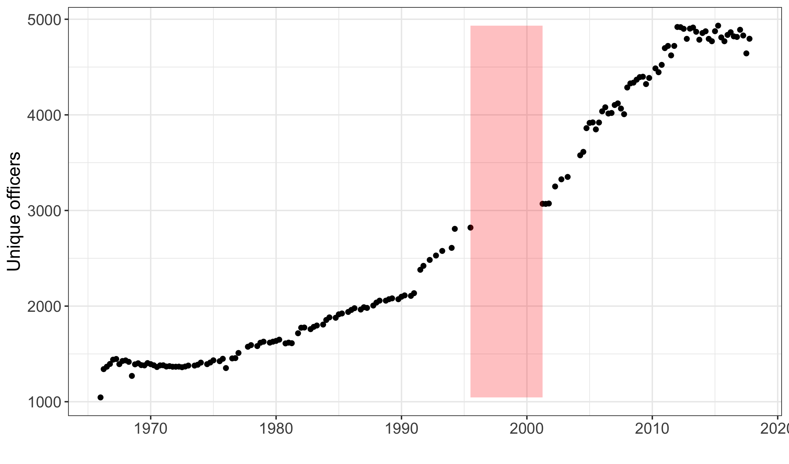

## Key Officers of the U.S. Foreign Service (1966-2017)

**Authors**: David Lindsey, Matt Malis, Calvin Thrall

**Data description**: Officer-post-quarter-year data on over 40,000 U.S. diplomats stationed at over 300 embassies, consulates, and other foreign diplomatic posts between 1966 and 2017. All diplomats are assigned a unique identifier. Metadata include the position(s) that each diplomat held in each quarter. 

**Data source(s)**: Key Officers of the U.S. Foreign Service documents (both in print and digital), released publicly by State Department.  

**Data publicly available?** Not yet; contact authors if interested.

**Associated publication(s)**: Lindsey, D, Malis, M, and Thrall, C. 2023. Revolving Door Diplomats. Work in progress.
