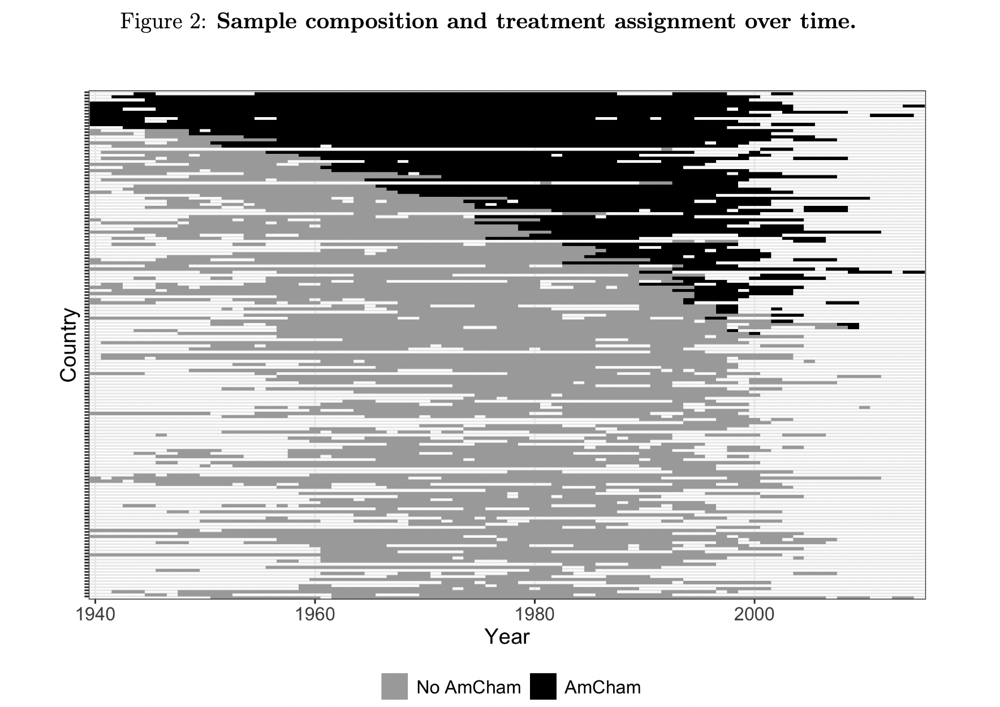

## Diplomatic Oral Histories as Text Data

**Author**: Calvin Thrall

**Data description**: Interview-segment level data from nearly 1,500 oral history interviews with retired diplomats; contains metadata including country, year of posting, year of interview, as well as diplomat demographics (when available). 

**Data source(s)**: Association for Diplomatic Studies and Training. 

**Data publicly available?** Not yet; contact author if interested.

**Associated publication(s)**: Thrall, C. 2023. [Informational Lobbying and Commerial Diplomacy](https://www.calvinthrall.com/assets/amcham_adst_0.5.0.pdf). Working paper.
