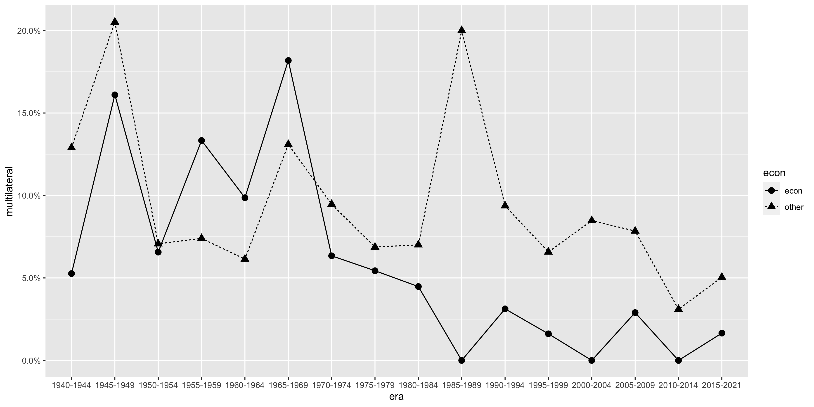

## U.S. Treaties and International Agreements (1776-2022)

**Authors**: Matt Malis, Calvin Thrall

**Data description**: Comprehensive data on all treaties and other international agreements that the U.S. has entered into since its inception. Combines and harmonizes several different existing treaty lists, and provides treaty-level metadata whenever available.  

**Data source(s)**: UN Treaty Collection, U.S. State Department. 

**Data publicly available?** Full dataset is still in progress. For all U.S. treaties in the United Nations Treaty Collection (1945-2022), see [dataverse](https://doi.org/10.7910/DVN/AFRCZH).

**If using data, please cite:** Malis, Matt, and Calvin Thrall. 2023. "U.S. Treaties from the UN Treaty Series: 1945-2022", https://doi.org/10.7910/DVN/AFRCZH, Harvard Dataverse.
