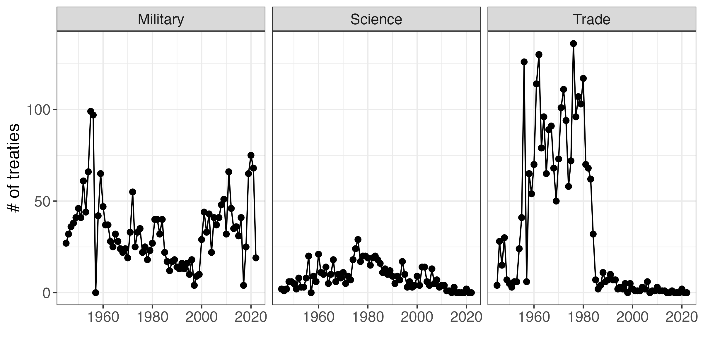

## U.S. Treaties from the UN Treaty Collection

**Authors**: Matt Malis, Calvin Thrall

**Data description**: Data on all treaties and other international agreements to which the U.S. is a party that have been deposited with the United Nations, 1945-2022. Available metadata includes issue categories, signing and entered-into-force dates, and signing locations. Note that, while the UNTC data is extensive, it does not contain all U.S. treaties and international agreements. For discussion of this, see [Hathaway et al 2020](https://chicagounbound.uchicago.edu/journal_articles/10208/).

**Data source(s)**: UN Treaty Collection.

**Data publicly available?** Yes: see [dataverse](https://doi.org/10.7910/DVN/AFRCZH).

**If using data, please cite:** Malis, Matt, and Calvin Thrall. 2023. "U.S. Treaties from the UN Treaty Series: 1945-2022", https://doi.org/10.7910/DVN/AFRCZH, Harvard Dataverse.
