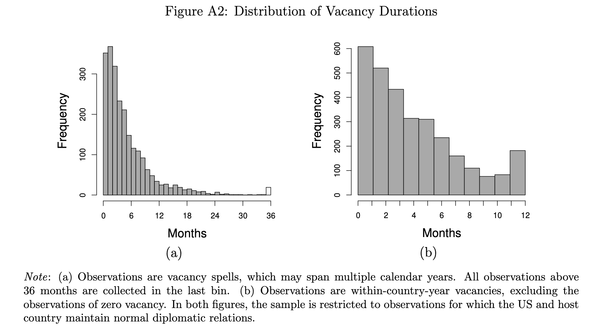

## Ambassadorial Appointments and Vacancies (1960-2014)

**Author**: Matt Malis

**Data description**: Country-year data on U.S. ambassadorial appointments and vacancies for all countries with which the U.S. maintainted diplomatic relations between the years of 1960 and 2014. 

**Data source(s)**: State Department online records.

**Data publicly available?** Yes; see [dataverse](https://dataverse.harvard.edu/dataset.xhtml?persistentId=doi:10.7910/DVN/ZTWOYY).

**Suggested citation**: Malis, Matt. (2021). Conflict, Cooperation, and Delegated Diplomacy. International Organization, 75(4), 1018-1057. [DOI](doi:10.1017/S0020818321000102).

**Associated publications**:
